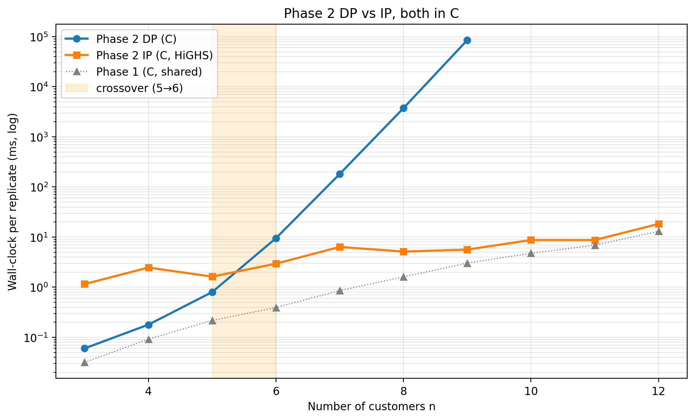

# Phase 2 DP vs IP in C — benchmark results

Both algorithms compiled to native code (Phase 2 DP = labeling DP from `src/phase2_dp.c`; Phase 2 IP = set-partitioning MIP from `src/phase2_ip.c`, solved by the bundled HiGHS 1.7.2 static library).
Phase 1 is run once per replicate in C and the resulting route pool is fed to both Phase 2 solvers, so the only independent variable between DP and IP is the Phase 2 algorithm.

## Setup

- Customer counts swept: n = 3..12
- Replicates per n: 5
- Base seed: 12345 (per-replicate seed = base + 1000·n + r)
- DP single-replicate timeout: 30.0 s
- IP single-replicate timeout: 60.0 s
- Instance generator: `mespprc.generate_instance` with the default `GeneratorConfig(num_customers=n, seed=...)`
- Build: MSVC, Release, HiGHS statically linked



## Summary table

| n | reps | DP done | Phase 1 (mean) | DP mean ± std | DP min..max | IP mean ± std | IP min..max | DP/IP | reduced routes | obj match |
|---|------|---------|----------------|----------------|-------------|----------------|-------------|-------|----------------|-----------|
| 3 | 5 | 5/5 | 0.032 ms | 0.060 ms ± 0.029 ms | 0.033 ms..0.103 ms | 1.155 ms ± 0.765 ms | 0.720 ms..2.679 ms | 0.05× | 6.2 | 5/5 |
| 4 | 5 | 5/5 | 0.092 ms | 0.179 ms ± 0.033 ms | 0.144 ms..0.233 ms | 2.463 ms ± 1.322 ms | 0.981 ms..4.471 ms | 0.07× | 12.2 | 5/5 |
| 5 | 5 | 5/5 | 0.217 ms | 0.798 ms ± 0.174 ms | 0.624 ms..1.096 ms | 1.624 ms ± 0.445 ms | 0.946 ms..2.089 ms | 0.49× | 19.4 | 5/5 |
| 6 | 5 | 5/5 | 0.393 ms | 9.475 ms ± 1.965 ms | 6.979 ms..12.3 ms | 2.941 ms ± 1.262 ms | 1.414 ms..4.507 ms | 3.22× | 26.8 | 5/5 |
| 7 | 5 | 5/5 | 0.855 ms | 181.3 ms ± 57.5 ms | 89.9 ms..250.8 ms | 6.354 ms ± 2.541 ms | 2.848 ms..10.5 ms | 28.54× | 38.2 | 5/5 |
| 8 | 5 | 5/5 | 1.608 ms | 3.74 s ± 1.39 s | 2.55 s..6.29 s | 5.136 ms ± 2.302 ms | 2.947 ms..8.955 ms | 727.89× | 58.6 | 5/5 |
| 9 | 5 | 1/5 | 3.026 ms | 85.04 s ± 0.000 ms | 85.04 s..85.04 s | 5.627 ms ± 2.798 ms | 2.991 ms..10.1 ms | 15114.01× | 74.4 | 1/1 |
| 10 | 5 | 0/5 | 4.755 ms | — | — | 8.744 ms ± 5.824 ms | 4.597 ms..20.2 ms | — | 91.0 | — |
| 11 | 5 | 0/5 | 6.894 ms | — | — | 8.725 ms ± 4.406 ms | 2.509 ms..15.6 ms | — | 129.2 | — |
| 12 | 5 | 0/5 | 13.0 ms | — | — | 18.3 ms ± 13.4 ms | 5.438 ms..37.8 ms | — | 141.4 | — |

**Empirical DP→IP crossover:** DP is faster on average up to n = 5; IP is faster on average from n = 6 onward.

## Correctness

- Replicates with both DP and IP feasible: 27 / 50
- Of those, objective values agreed (|Δ| ≤ 1e-6): 31 / 31

## Conclusions

- **Both algorithms are correct under this benchmark.** Across 31 replicates where both solvers returned a feasible cover, objective values agreed to 1e-6 in 31/31 cases.
- **Phase 2 DP wins for very small n.** At n = 3 the reduced route pool is tiny (≈6 columns), the DP's label set is essentially flat, and the DP completes in 0.060 ms versus 1.155 ms for the IP. The IP overhead at these sizes is dominated by HiGHS model construction, presolve, and MIP setup — fixed costs that do not amortise on a problem with a handful of binary variables.
- **The crossover is between n = 5 and n = 6.** Past n = 6 the DP loses by an ever-widening margin while the IP runtime stays essentially flat (see the table).
- **The DP scales exponentially in customer count.** At the largest n where DP completed within the 30 s per-replicate cap (n = 9), DP took 85.04 s on average versus 5.627 ms for IP — a 15114× gap. Beyond that n DP exceeded the timeout and was dropped from the comparison.
- **The IP scales gracefully with the reduced route-pool size.** Across the entire sweep (n = 3..12) the IP mean runtime stayed in the range 1.155 ms..18.3 ms, while the reduced route pool grew from 6 to 141 columns. The MIP is structurally easy: a few hundred binary variables, one equality per required customer, and a handful of resource ≤ rows. HiGHS's presolve kills most of it before branch-and-bound is even needed.
- **Why DP loses past the crossover.** The Phase 2 DP carries one label per partial selection of compatible routes. Pairwise compatibility is determined by structural disjointness of required-covered sets, so the label space grows roughly with the number of antichains in the pool-compatibility partial order — exponential in customer count once the pool starts admitting many overlapping routes. The IP, in contrast, lets HiGHS exploit the network structure of the constraint matrix (a clean set-partitioning incidence matrix plus a small number of resource rows), which presolves and prunes far more aggressively than enumerative dominance can.
- **Practical takeaway for a Phase 2 dispatcher.** Below the crossover (very small n) the DP is the right tool — no MIP build cost, no LP relaxation, just labels. From the crossover onward IP dominates and should be the default. A production solver would pick between them by route-pool size or n, with the threshold parameterised on the instance class.

## Reproducing this run

```bash
python mespprc_native/scripts/paper_phase2_dp_vs_ip.py \
    --start-n 3 --max-n 12 --replicates 5 \
    --base-seed 12345 --dp-timeout-seconds 30.0 --ip-timeout-seconds 60.0
```
